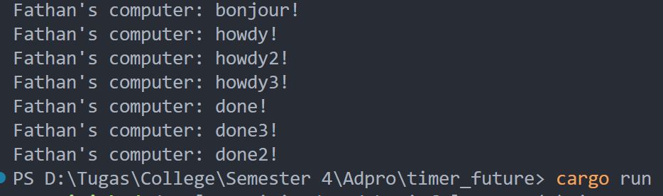

# Module 10 - Reflection
> Fathan Naufal Adhitama - 2206825965 - Pemrograman Lanjut A

## 1.2 Understanding how it works

Pada gambar di atas, terlihat bahwa output 'bonjour!' diprint lebih dulu daripada 'howdy!' dan 'done!'. Ini terjadi karena perintah print untuk 'howdy' dan 'done' terdapat didalam sebuah task yang di-spawn menggunakan `spawner.spawn(async { ... }),` di mana perintah tersebut akan dijalankan secara asinkronus setelah `executor.run()` dijalankan. Sementara itu, perintah print 'bonjour!' berada di main thread yang akan dieksekusi tanpa menunggu perintah executor.run(). Oleh karena proses tersebutlah, output di atas dapat dihasilkan.

## 1.3 Experiment 1.3: Multiple Spawn and removing drop
Dengan perintah drop:

  
Tanpa perintah drop:

Pada gambar di atas, terlihat output yang dihasilkan dengan multiple spawn dan perbedaan antara penggunaan perintah drop dan tidak. Output yang dihasilkan akan tetap diprint setelah bonjour yang berada di main thread. Akan tetapi, urutan perintah dieksekusi tidak beraturan karena tiap task dijalankan secara asinkronus dan independen antara satu sama lain. Selain itu, ketika tidak menghapus perintah drop, program tidak selesai dan masih berjalan. Ini terjadi karena tanpa perintah drop, executor tidak akan tahu bahwa sudah tidak ada task lagi dan executor masih akan terus menunggu task lagi untuk di-run.